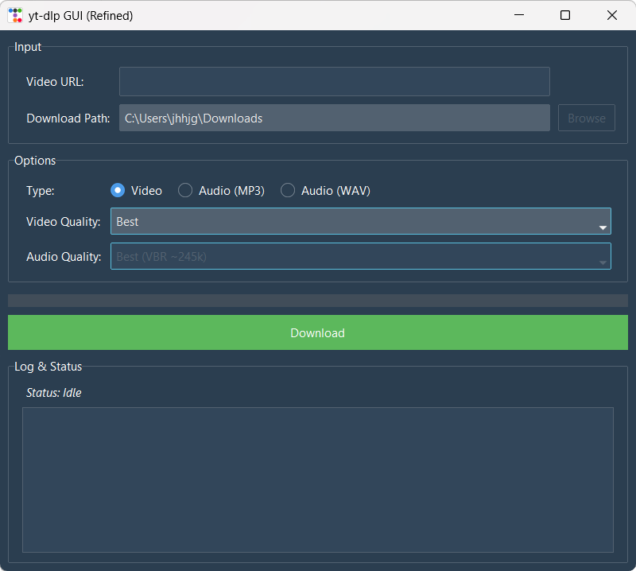

# yt-dlp GUI

[](https://opensource.org/licenses/MIT)

A clean, modern, and user-friendly Graphical User Interface for the `yt-dlp` command-line tool. Download videos and audio from YouTube without ever touching the terminal.

  

---

## Features

- **Simple Interface**: Just paste a URL, choose your options, and click download.
- **Video & Audio**: Download full videos or extract audio into MP3 or lossless WAV files.
- **Quality Selection**: Choose your preferred video resolution or audio bitrate.
- **Real-Time Progress**: A progress bar and detailed log keep you updated on the download status.
- **Modern Look**: Built with `ttkbootstrap` for a great look and feel on any OS.
- **Cross-Platform**: Works on Windows, macOS, and Linux.

## Prerequisites

Before you begin, ensure you have the following installed:

1.  **Python 3.8+**
2.  **FFmpeg**: This is **essential** for `yt-dlp` to download high-quality streams and convert audio.
    -   **Windows**: Download a build from [gyan.dev](https://www.gyan.dev/ffmpeg/builds/) and add the `bin` folder to your system's PATH.
    -   **macOS (Homebrew)**: `brew install ffmpeg`
    -   **Linux (Debian/Ubuntu)**: `sudo apt update && sudo apt install ffmpeg`

## Installation

1.  **Clone the repository:**
    ```bash
    git clone https://github.com/YourUsername/yt-dlp-gui.git
    cd yt-dlp-gui
    ```

2.  **Install Python dependencies:**
    It's highly recommended to use a virtual environment.
    ```bash
    python -m venv venv
    source venv/bin/activate  # On Windows, use `venv\Scripts\activate`
    ```
    Then, install the required packages:
    ```bash
    pip install -r requirements.txt
    ```

## Usage

Once the installation is complete, run the application with:

```bash
python ytdlp_gui.py
